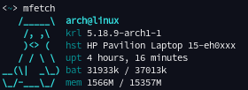

# Fetch Maneki

A lightweight system information tool inspired by neofetch and most
notably, pfetch. The ascii art is made from scratch but are inspired
by ufetch's.

The actual script is created by the Makefiles and it's only 8 lines
long.

## Dependencies

- [Ruby](https://www.ruby-lang.org/) (make)

## Installation

Default installation:

	# make install clean

Custom installation example:

	# make install clean OS=gentoo \
		ASCII_COLOR='\e[1;35m' \
		SPECIAL_COLOR='\e[1;35m' \
		KEY_COLOR='\e[0;37m' \
		LINE_0=kernel \
		LINE_1=uptime \
		LINE_2=battery \
		LINE_3=memory \
		LINE_4=none \
		LINE_5=user_at_host

## Contibuting

Bug reports, suggestions and pull requests are welcome!

What's more needed:
- ASCII art of more operating systems
- More fetching commands (cpu, terminal, hardware, etc)
- Makefile.rb translation to POSIX shell

